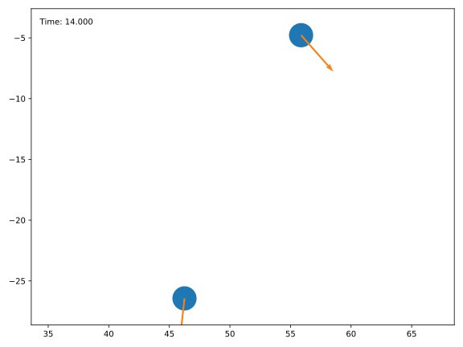

# billiards
> A 2D physics engine for simulating dynamical billiards

_billiards_ is a python library that implements a very simple physics engine:
It simulates the movement of particles that live in two dimensions.
When particles collide they behave like hard balls.
Basically the particles act like billiard balls.
This type of dynamical system is also known as [dynamical billiards](https://en.wikipedia.org/wiki/Dynamical_billiards).


- Free software: GPLv3+ license, see `LICENSE` for more information.


## Quickstart

Clone the repository from GitHub and install the package with setuptools:
```shell
$ git clone https://github.com/markus-ebke/billiards.git
$ pip install .[visualize]
```
This will also let you create pictures and videos of your billiard.

Note that _billiards_ depends on _numpy_ (and _matplotlib_ for visualization), setuptools will install it automatically.

Import the library and setup an empty billiard world:

```python
>>> import billiards
>>> bil = billiards.Billiard()
```

Add one ball at position (2, 0) with velocity (4, 0):

```python
>>> idx = bil.add_ball((2, 0), (4, 0), radius=1)
>>> print(idx)
0
```

The `add_ball` method will return an index that we can use later to retrieve the data of this ball from the simulation.
To see where the ball is at time = 10 units:
```python
>>> bil.evolve(end_time=10.0)
>>> print("({}, {})".format(*bil.balls_position[idx]))
(42.0, 0.0)
>>> print("({}, {})".format(*bil.balls_velocity[idx]))
(4.0, 0.0)
>>> billiards.visualize.plot(bil)
```


Now add another ball that will collide with the first one:
```python
>>> bil.add_ball((50, 18), (0, -9), radius=1, mass=2)
1
>>> print("t={:.7}, idx1={}, idx2={}".format(*bil.toi_next))
t=11.79693, idx1=0, idx2=1
>>> bil.evolve(14.0)
>>> print(bil.time)
14.0
>>> print(bil.balls_position)
[[ 46.25029742 -26.4368308 ]
 [ 55.87485129  -4.7815846 ]]
>>> print(bil.balls_velocity)
[[ -1.33333333 -12.        ]
 [  2.66666667  -3.        ]]
>>> billiards.visualize.plot(bil)
```


The collision changed the course of both balls!
Note that the collision is elastic, i.e. it preserves the total kinetic energy.

## Authors

- Markus Ebke - <https://github.com/markus-ebke>

